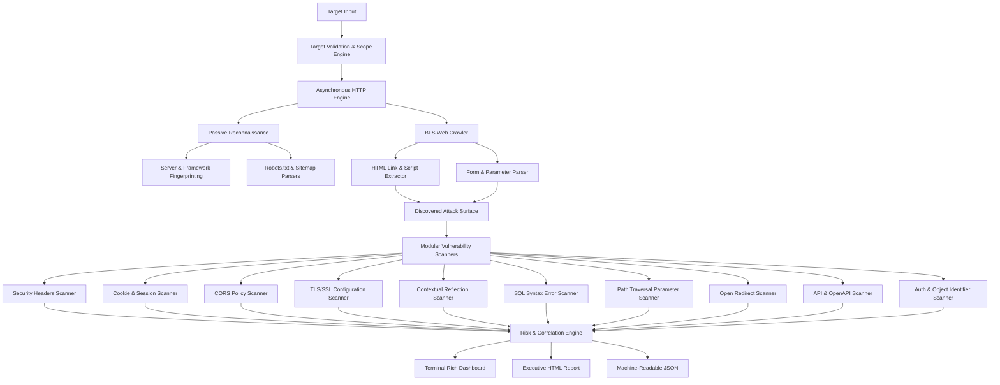

# WebVuln Scanner — Architecture & System Design

## Modular Layers

1. **Target Validation Layer (`webvuln.core.target`)**: Strict URL normalization, protocol verification (`http`/`https`), and domain boundary enforcement.
2. **Asynchronous Transport Layer (`webvuln.core.context`)**: Connection pooling, concurrency semaphores, rate limiting, and memory-safe 2MB body buffering.
3. **Discovery Layer (`webvuln.discovery`)**: BFS crawling, deduplication hashing, parameter extraction, and passive robots/sitemap parsing.
4. **Vulnerability Assessment Layer (`webvuln.scanners`)**: 10 independent active/passive security audit modules adhering to [`BaseScanner`](file:///C:/Users/ACER/.gemini/antigravity/scratch/webvuln-scanner/webvuln/core/scanner.py).
5. **Risk Engine Layer (`webvuln.core.risk`)**: Multi-factor scoring combining severity weights and confidence multipliers, with finding deduplication.
6. **Reporting Layer (`webvuln.reporting`)**: Rich terminal summary UI, structured JSON data, and Jinja2-rendered HTML executive reports.
